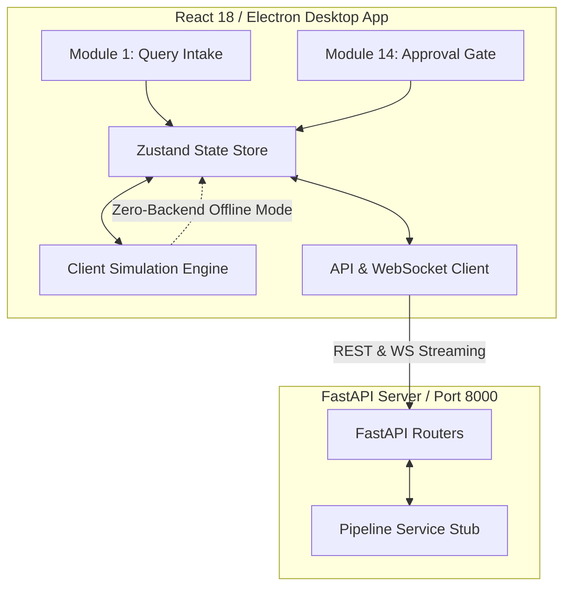
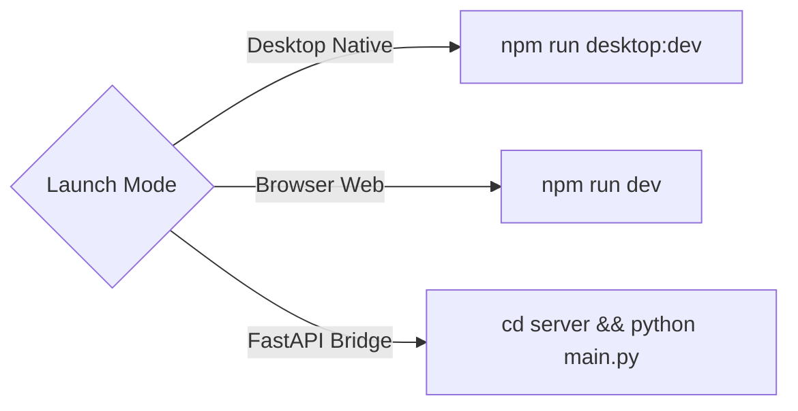

<div align="center">

# NL2SQL Desktop & Web Studio Shell

### Native Desktop & Responsive Web Observability Interface

[](https://github.com/VanshikaKritiSingh/NL2SQL)
[](https://www.electronjs.org/)
[](https://react.dev/)
[](https://www.typescriptlang.org/)
[](https://vitejs.dev/)
[](https://fastapi.tiangolo.com/)

<br />

**Lead UI / Systems Engineer:** Vanshika Kriti Singh &nbsp;|&nbsp; **Package:** `GUI/`

</div>

<br />

---

## Studio Interface Architecture

The Studio Shell unifies **Module 1 (Query Intake)** and **Module 14 (Human Approval Gate)** into a cohesive desktop and web application with dual execution modes:



---

## Key Features

- **Module 1 (M1) - Natural Language Intake & Inspection:**
  - Interactive multi-dialect selector (PostgreSQL, MySQL, SQLite, DuckDB, Snowflake, BigQuery, Neo4j, MongoDB).
  - Live 16-stage pipeline progress indicator with timing and stage event payloads.
  - Monaco SQL code editor with syntax highlighting, AST inspections, and parameter bindings.
  - Paginated sandbox query result table.

- **Module 14 (M14) - Safety Guardrail & Human Approval Gate:**
  - Triggered automatically on mutating (DML) or schema-modifying (DDL) queries.
  - Interactive React Flow ER diagram visualizing write-target impact borders (Red = Primary Target, Yellow = Cascading FK).
  - Side-by-side Monaco DDL schema diff view and tabular before/after DML diffs.
  - Pre-flight EXPLAIN cost telemetry, row scan estimation, and deadlock/security risk badges.

- **Dual Execution Modes:**
  - **Standalone Simulation Mode:** Built-in client-side mock service allowing testing without spinning up Python backends.
  - **Live Bridge Mode:** Proxies requests over HTTP and WebSockets to the Python FastAPI backend on port 8000.

---

## Execution Modes & Launch Commands



### 1. Native Desktop Application
Runs in an Electron container with hot-module reloading and native desktop window controls:

```bash
# Navigate to GUI directory
cd GUI

# Run live development desktop mode (Vite + Electron)
npm run desktop:dev

# Run pre-packaged desktop executable
npm run desktop

# Build standalone Windows installer/executable
npm run desktop:build
```

### 2. Web Browser Client
Runs in any modern web browser:

```bash
cd GUI
npm run dev
```
Local URL: `http://localhost:5173`

---

## Directory Structure

```
GUI/
|-- electron/               # Native desktop lifecycle (main.cjs, preload.cjs)
|-- src/
|   |-- api/                # API client layer with automatic mock fallback
|   |-- hooks/              # WebSocket listeners and React state hooks
|   |-- mock/               # Zero-dependency client simulation engine
|   |-- modules/
|   |   |-- m1/             # Query intake, Monaco editor, progress tracker
|   |   `-- m14/            # React Flow ER graph, Monaco diffs, telemetry
|   |-- shared/             # TopBar, DialectSelector, RiskBadge, StatusBar
|   |-- store/              # Zustand state stores (app, query, pipeline)
|   `-- types/              # TypeScript schemas for requests and payloads
|-- server/                 # FastAPI Python backend bridge stubs
|-- package.json            # Desktop & web script definitions
`-- vite.config.ts          # Bundler configuration with relative asset paths
```

---

## Backend Bridge Integration

To connect the GUI shell to the live Python pipeline:

```bash
# 1. Start FastAPI pipeline bridge (from repository root)
cd GUI/server
python main.py

# 2. Launch GUI Studio (in another terminal)
cd ..
npm run desktop:dev
```

---

<div align="center">

*NL2SQL GUI Module: Technical Documentation & Implementation Reference*

</div>
