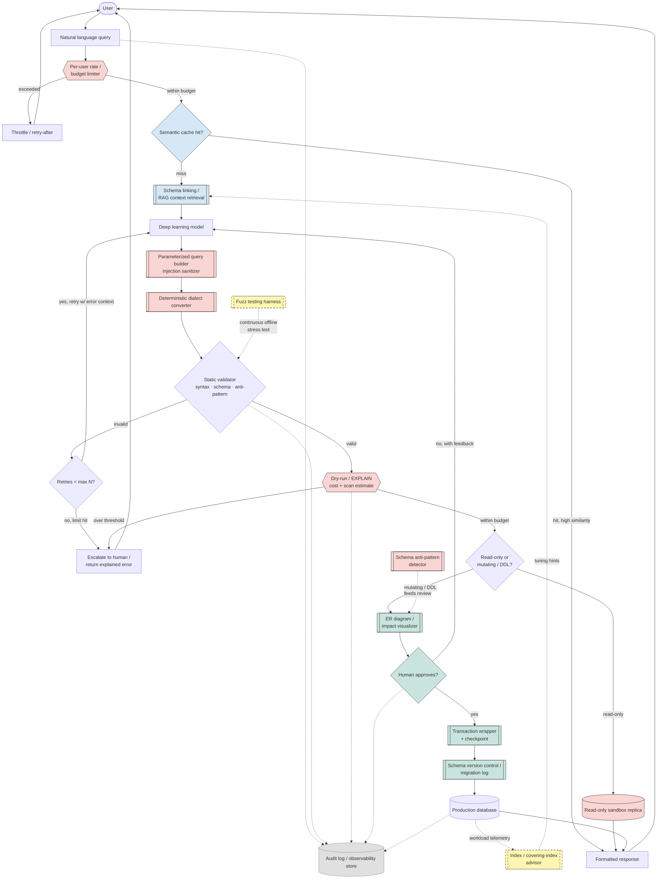

# NL2SQL Pipeline — Production Architecture

**Status:** Design draft for team review
**Companion file:** `diagrams/SVG_DIAGRAM.svg` (static image — use this in tools that can't render Mermaid, e.g. Confluence, plain PDF export, email)

---

## 1. Overview

This document describes a human-supervised natural-language-to-SQL (NL2SQL) pipeline: a system that lets a person query and modify a database in plain English, while keeping an AI agent from ever writing to the database unsupervised.

The core loop is: **query → cache check → generate SQL → validate → estimate cost/risk → route by risk tier → (human approval if needed) → execute → return results.** Every sub-project and safety mechanism in this document exists to strengthen one specific stage of that loop — nothing is included just because it's a good idea in isolation.

---

## 2. Architecture diagram

**Legend:** blue = pre-flight (cache/context) · pink = security/cost gates in the live path · green = human-facing/write-path tooling · yellow dashed = offline background support · gray dashed = cross-cutting audit log.

---

## 3. Stage-by-stage walkthrough

| # | Stage | Purpose |
|---|-------|---------|
| 1 | Rate / budget limiter | Blocks runaway request volume per user before any cost is incurred. |
| 2 | Semantic cache | Skips the entire model + validation + execution path when a semantically equivalent question was already answered. |
| 3 | Schema linking / RAG retrieval | Narrows the schema handed to the model to only the relevant tables, instead of dumping the whole database schema into every prompt. |
| 4 | Deep learning model | Generates a candidate SQL statement from the natural-language query (plus retry feedback, if looping). |
| 5 | Injection sanitizer | Rewrites/validates the generated SQL through a parameterized query builder rather than raw string concatenation. |
| 6 | Dialect converter | Normalizes the SQL to the target database engine's actual dialect. |
| 7 | Static validator | Checks syntax, schema validity, and known anti-patterns before anything is costed or executed. |
| 8 | Retry gate | Bounded retry loop — after N failed attempts, escalate instead of looping forever. |
| 9 | Cost / risk gate | Runs an EXPLAIN-style dry run to estimate cost and rows scanned; rejects or escalates anything over threshold. |
| 10 | Risk tier router | Splits read-only queries (auto-execute against a sandbox) from mutating/DDL statements (require human review). |
| 11 | ER diagram / impact visualizer | Shows the human reviewer what the query will actually touch before they approve it. |
| 12 | Human approval gate | Required only for writes/schema changes — not for every query. |
| 13 | Transaction wrapper + checkpoint | Wraps approved writes in a transaction with a rollback point. |
| 14 | Schema version control | Tracks every committed schema/data change like a migration log, for audit and rollback. |
| 15 | Audit log | Cross-cutting log of every query, decision, and outcome — not a pipeline stage a request "passes through," but a side channel every stage writes to. |

---

## 4. Included sub-projects and their mechanisms

Each of these was kept because it plugs directly into one of the stages above — not because it's a good idea in isolation.

| Sub-project | Mechanism | Where it plugs in |
|---|---|---|
| **SQL Injection Prevention Query Builder** | Forces all generated SQL through parameterized queries/prepared statements instead of string concatenation; rejects raw literal interpolation. | Immediately after generation, before validation. |
| **Deterministic DBMS-Specific SQL Converter** | Parses SQL into an AST with a dialect-aware parser, then applies fixed, rule-based transformations (e.g. `LIMIT x,y` → `LIMIT y OFFSET x`) so the same input always produces the same output. | Between the sanitizer and the validator. |
| **SQL Fuzz Testing Framework** | Grammar-based/mutation-based fuzzer that generates large volumes of valid, edge-case, and malformed queries and runs them against a sandboxed instance to catch validator gaps. | Offline, continuously hardening the validator — not in the live request path. |
| **Schema Anti-Pattern Detector** | Parses DDL/`information_schema` metadata and runs rule-based checks against known bad patterns (EAV misuse, generic polymorphic columns, missing FKs). | Runs when the approved statement is schema-altering, feeding the impact visualizer. |
| **ER Diagram Generator from SQL DDL** | Parses `CREATE TABLE` statements, builds a table/FK graph, and renders it visually. | Powers the impact-visualizer step the human sees before approving a write. |
| **Schema Version Control ("Git for DB")** | Diffs and versions schema changes like a VCS, generating migration scripts and enabling rollback. | Wraps every committed write/schema change. |
| **Covering Index / Index Recommendation** | Parses query logs and execution plans to suggest composite indexes that let queries be satisfied index-only. | Background loop: reads workload telemetry, feeds tuning hints back into schema linking. |

### Deliberately excluded (good tools, wrong pipeline)

- **Automated Relational Schema from ER Diagram**, **Multivalued Dependency Visualizer**, **Denormalization Advisor**, **Step-by-step Normalization Pipeline** — all schema-*design*-phase tools with no per-query runtime tie-in to this pipeline.
- **Database Workload Re-player**, **Schema-Drift Detector**, **Vector Index Extension**, **Warehouse-Free Analytics Dashboard** — valuable ops/infrastructure tools, but orthogonal to an NL2SQL agent specifically.

---

## 5. Production practices baked into this design

- **Cache before you generate.** A semantic cache in front of the pipeline compares the incoming query's embedding against previously answered queries and returns the cached response on a high-confidence match, skipping the full model/validation/execution path entirely. [1][2]
- **Narrow the schema before generation.** One documented pattern classifies query intent and extracts entities first, then maps those to only the relevant tables before the model ever sees the schema — this scales to databases far too large to fit in a prompt. [3]
- **Bound every retry loop.** An unbounded "invalid → retry" loop is a production incident waiting to happen; retries need a max count with an explicit escalation path. [4]
- **Estimate cost before you execute.** Running an EXPLAIN-style simulation of the generated query and rejecting or escalating anything over a cost/scan threshold prevents the runaway full-table-scan query, and pairing it with per-user rate/budget limits and full audit logging gives both a cost control and an audit trail. [4]
- **Tier risk instead of gating everything the same way.** Low-risk actions (reads) can run automatically; medium-risk actions get a notification; only high-blast-radius actions (writes, schema changes) require a human sign-off — treating every action the same way either over-blocks or under-protects. [5][6]
- **Wrap writes in a transaction with a checkpoint.** New agent behavior is typically proven first in a shadow/dry-run mode, and checkpointing lets a long-running process resume from its last known-good state rather than restart blindly after a failure — this is why the write path goes through a transaction wrapper before touching schema version control. [7]
- **Log everything, as a cross-cutting concern.** Guardrails work best as layered controls — policy checks, scoped roles, and human approval reserved for high-impact actions — with every decision logged for accountability; this is why the audit log is drawn as a side-channel every stage writes to, not a stage a request passes through. [5]
- **Production readiness is a context/governance problem more than a syntax problem.** NL2SQL systems succeed or fail less on the model's raw SQL-writing ability and more on business context, query governance, and support for iterative follow-up — which is why schema linking, risk-tiering, and the audit layer carry as much weight in this design as the model itself. [8]

---

## 6. Suggested implementation phasing

**Day one (cheap to build, removes entire risk classes):**
- Per-user rate limiter
- Parameterized query builder / injection sanitizer
- Read-only sandbox replica for the read path
- Bounded retry gate

**Fast-follow (needs real query volume to tune thresholds):**
- Semantic cache (similarity threshold tuning)
- Cost/EXPLAIN gate (threshold calibration against real workload costs)
- Index/covering-index advisor (needs workload telemetry to be useful)

**Ongoing / offline:**
- Fuzz testing harness against the validator
- Schema anti-pattern detector as a scheduled review job

---

## 7. References

1. Semantic Caching in RAG Systems & AI Agents — DEV Community, https://dev.to/sreeni5018/semantic-caching-in-rag-systems-ai-agents-2gal
2. Semantic Caching for LLMs: How to Measure Latency, Cost, and Quality — Medium, https://medium.com/@mohantaastha/semantic-caching-for-llms-how-to-measure-latency-cost-and-quality-before-you-optimize-64ff73b0f370
3. Bridging Natural Language and Databases: Best Practices for LLM-Generated SQL — Medium, https://medium.com/@vi.ha.engr/bridging-natural-language-and-databases-best-practices-for-llm-generated-sql-fcba0449d4e5
4. Why You Shouldn't Use LLMs To Generate SQL (Security Risks) — Protecto, https://www.protecto.ai/blog/llm-generated-sql-risks/
5. Guardrails for Autonomous AI Agents: Production Safety 2026, https://khimananda.com/blog/guardrails-for-autonomous-ai-agents
6. Before You Go Agentic: Top Guardrails to Safely Deploy AI Agents in Observability — DevOps.com, https://devops.com/before-you-go-agentic-top-guardrails-to-safely-deploy-ai-agents-in-observability/
7. AI Agent Rollback Strategy: Best Practices 2026 — Fastio, https://fast.io/resources/ai-agent-rollback-strategy/
8. Natural Language to SQL: The Complete 2026 Guide — BlazeSQL, https://www.blazesql.com/blog/natural-language-to-sql
