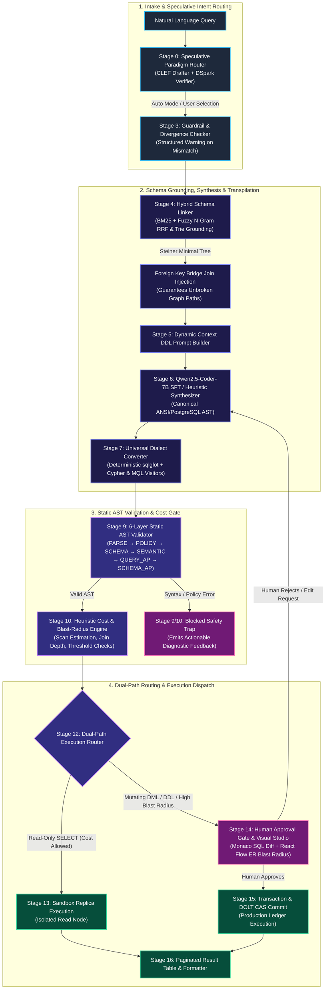

<div align="center">

# NL2SQL Production Pipeline

### Enterprise Natural Language to Multi-Paradigm Database Compiler

[](https://github.com/VanshikaKritiSingh/NL2SQL)
[](https://github.com/VanshikaKritiSingh/NL2SQL)
[](https://www.python.org/)
[](https://fastapi.tiangolo.com/)
[](https://react.dev/)
[](https://github.com/tobymao/sqlglot)
[](https://huggingface.co/Qwen/Qwen2.5-Coder-7B-Instruct)
[](LICENSE)

<br />

[Overview](#executive-summary) &bull; [System Architecture](#system-architecture) &bull; [Universal Transpilation](#universal-ast-transpilation-engine) &bull; [Paradigms & Dialects](#multi-paradigm--dialect-support) &bull; [Offline ML Suite](#offline-machine-learning--fine-tuning-suite) &bull; [Quick Start](#quick-start) &bull; [Directory Layout](#repository-structure) &bull; [Engineering Team](#engineering-team)

</div>

<br />

---

## Executive Summary

The **NL2SQL Production Pipeline** is an enterprise-grade compilation framework that transforms natural language requests into deterministic, semantically validated, and cost-controlled queries across **6 database paradigms** and **20+ dialects**.

### Core Architecture Guarantees
1. **Zero Unsupervised Production Writes:** Mutating queries (`INSERT`, `UPDATE`, `DELETE`) and schema migrations (`ALTER`, `DROP`) are intercepted by a mandatory **Dual-Path Execution Router** and escalated to a visual human review gate.
2. **Deterministic Universal Transpilation:** Canonical ANSI/PostgreSQL AST is transpiled in `< 5ms` without runtime LLM token consumption into 20+ SQL dialects, openCypher (Neo4j / AWS Neptune), and MongoDB MQL.
3. **Speculative Intent Routing (DSpark Principles):** Fast CLEF-style discourse classifier (< 2ms) routes queries with speculative confidence scheduling and auto-mode divergence guardrails.
4. **Hybrid Schema Grounding:** Combines snake_case-aware BM25 and character N-gram fuzzy salience merged via **Reciprocal Rank Fusion (RRF)**, backed by Steiner Minimal Tree foreign-key bridge join injection and sub-millisecond Trie cell grounding.
5. **Consumer Hardware Feasibility:** 4-bit NF4 QLoRA fine-tuning fits consumer GPUs (< 7.5GB VRAM on RTX 4060 8GB / RTX 3060 12GB), quantizing to `Q4_K_M` GGUF for CPU inference (~4.3GB RAM).

---

## System Architecture

The pipeline executes through 16 human-supervised stages structured into four cohesive layers:



---

## Universal AST Transpilation Engine

A single canonical ANSI SQL AST is compiled deterministically into 20+ SQL, Graph, and Document targets in `< 5ms`:

```mermaid
flowchart LR
    classDef source fill:#0f172a,stroke:#38bdf8,stroke-width:2px,color:#f8fafc;
    classDef engine fill:#1e1b4b,stroke:#a855f7,stroke-width:2px,color:#f8fafc;
    classDef sql fill:#064e3b,stroke:#10b981,stroke-width:2px,color:#f8fafc;
    classDef graph fill:#172554,stroke:#3b82f6,stroke-width:2px,color:#f8fafc;
    classDef doc fill:#451a03,stroke:#f97316,stroke-width:2px,color:#f8fafc;

    AST["Canonical ANSI/PostgreSQL AST<br/>(sqlglot Expression Tree)"]:::source --> ENGINE["Deterministic Dialect Transpiler<br/>(core/dialect_converter.py)"]:::engine

    ENGINE -->|"Native AST Re-writer"| SQL_GROUP["Relational & OLAP Engines"]:::sql
    subgraph SQL_GROUP ["20+ SQL & Cloud Data Warehouses"]
        SQL1["PostgreSQL & MySQL"]:::sql
        SQL2["SQLite & DuckDB"]:::sql
        SQL3["Snowflake & Google BigQuery"]:::sql
        SQL4["ClickHouse & StarRocks"]:::sql
        SQL5["Oracle & T-SQL / SQL Server"]:::sql
        SQL6["Trino, Presto & Apache Spark"]:::sql
    end

    ENGINE -->|"OpenCypherVisitor"| GRAPH_GROUP["Graph Databases"]:::graph
    subgraph GRAPH_GROUP ["Declarative Graph Paradigm"]
        G1["Neo4j (MATCH ... WHERE ... RETURN)"]:::graph
        G2["AWS Neptune (openCypher Endpoint)"]:::graph
        G3["Kùzu Embedded Graph Engine"]:::graph
    end

    ENGINE -->|"MongoMQLVisitor"| DOC_GROUP["Document NoSQL Engines"]:::doc
    subgraph DOC_GROUP ["Hierarchical Aggregation Pipelines"]
        D1["MongoDB ($match, $lookup, $unwind)"]:::doc
        D2["Amazon DocumentDB ($group, $project)"]:::doc
    end
```

---

## Multi-Paradigm & Dialect Support

| Paradigm | Underlying Mechanism | Supported Dialects & Engines | Primary Workload Focus |
| :--- | :--- | :--- | :--- |
| **Relational (RDBMS)** | ANSI SQL & Relational Algebra | PostgreSQL, MySQL, SQLite, Oracle, T-SQL / SQL Server, MariaDB | Transactional consistency, normalized tables |
| **Column-Family / OLAP** | Vectorized Columnar Scanning | Snowflake, Google BigQuery, ClickHouse, DuckDB, Redshift, StarRocks, Trino, Presto, Spark SQL, Databricks | Analytical aggregations, multi-billion row scans |
| **Graph Database** | Declarative Graph Traversal | Neo4j, AWS Neptune (openCypher endpoint), Kùzu | Multi-hop paths, shortest path, fraud rings |
| **Document NoSQL** | Hierarchical MQL Aggregation | MongoDB, Amazon DocumentDB, CouchDB | Dynamic schemas, polymorphic JSON sub-documents |
| **Key-Value (KV)** | Hash Map Lookups & Mutations | Redis, Amazon DynamoDB (KV mode), Memcached | Sub-millisecond point lookups, token store |
| **Time-Series** | Timestamp Bucket Aggregations | TimescaleDB, InfluxDB | Telemetry rollups, sliding sensor windows |

---

## 6-Layer Static AST Validation Architecture

Every generated query undergoes a 6-layer verification pipeline before cost estimation or execution:

```mermaid
flowchart TD
    classDef l1 fill:#0f172a,stroke:#38bdf8,stroke-width:2px,color:#f8fafc;
    classDef l2 fill:#1e1b4b,stroke:#818cf8,stroke-width:2px,color:#f8fafc;
    classDef l3 fill:#312e81,stroke:#a855f7,stroke-width:2px,color:#f8fafc;
    classDef l4 fill:#4c1d95,stroke:#c084fc,stroke-width:2px,color:#f8fafc;
    classDef l5 fill:#701a75,stroke:#f472b6,stroke-width:2px,color:#f8fafc;
    classDef l6 fill:#831843,stroke:#fb7185,stroke-width:2px,color:#f8fafc;

    Q[Canonical SQL Query] --> L1["Layer 1: PARSE<br/>• Single-statement enforcement (PARSE_01)<br/>• Syntax & AST grammar check (PARSE_02)"]:::l1
    L1 --> L2["Layer 2: POLICY<br/>• Statement allowlist (POLICY_01)<br/>• Block DROP DATABASE / TRUNCATE (POLICY_02)<br/>• Block GRANT / REVOKE & COPY PROGRAM (POLICY_03/04)<br/>• UPDATE/DELETE without WHERE guard (POLICY_05)"]:::l2
    L2 --> L3["Layer 3: SCHEMA<br/>• Table & column existence in catalog (SCHEMA_01/02)<br/>• Ambiguous join column detection (SCHEMA_03)<br/>• Alias reference resolution (SCHEMA_04)"]:::l3
    L3 --> L4["Layer 4: SEMANTIC<br/>• Non-aggregated column in GROUP BY check (SEM_01)<br/>• Aggregate in WHERE clause detection (SEM_02)<br/>• INSERT column/value parity (SEM_03)"]:::l4
    L4 --> L5["Layer 5: QUERY ANTI-PATTERNS<br/>• SELECT * production warning (QUERY_AP_01)<br/>• Cartesian product / CROSS JOIN check (QUERY_AP_02)<br/>• Leading-wildcard LIKE '%...' warning (QUERY_AP_03)<br/>• Unbounded ORDER BY without LIMIT (QUERY_AP_06)"]:::l5
    L5 --> L6["Layer 6: SCHEMA ANTI-PATTERNS (DDL)<br/>• CREATE TABLE without PRIMARY KEY (SCHEMA_AP_01)<br/>• Monetary FLOAT type warning (SCHEMA_AP_06)"]:::l6
    L6 --> PASS["Validation Passed (Status: VALID / VALID_WITH_WARNINGS)"]
```



---

## Offline Machine Learning & Fine-Tuning Suite

```mermaid
flowchart LR
    classDef stage fill:#1e1b4b,stroke:#818cf8,stroke-width:2px,color:#f8fafc;
    classDef artifact fill:#064e3b,stroke:#34d399,stroke-width:2px,color:#f8fafc;

    D_GEN["offline/datasets/prepare_dataset.py<br/>Multi-Schema Synthetic SFT Generator"]:::stage --> D_OUT["train.jsonl & eval.jsonl<br/>(ChatML Instruction Pairs)"]:::artifact
    
    D_OUT --> TRAIN["offline/training/train_qlora.py<br/>4-bit NF4 QLoRA SFT<br/>(Target All Linears, r=16, a=32)"]:::stage
    
    TRAIN --> ADAPTER["LoRA Checkpoints<br/>(< 7.5GB VRAM on RTX 4060)"]:::artifact
    
    ADAPTER --> EXPORT["offline/training/export_gguf.py<br/>16-bit Merge + GGUF Quantizer"]:::stage
    
    EXPORT --> GGUF["model-q4_k_m.gguf + Modelfile<br/>(~4.3GB RAM on CPU / Ollama)"]:::artifact
    
    GGUF --> EVAL["offline/training/evaluate.py<br/>AST Exact Match & SQLite EX Accuracy"]:::stage
```



---

## Repository Structure

```
NL2SQL/
|-- core/                            # Core Runtime Engine (AI/ML Backbone)
|   |-- paradigm_suggestor.py        # CLEF intent drafter & speculative router
|   |-- schema_linker.py             # Hybrid BM25/Fuzzy RRF retrieval & Steiner join builder
|   |-- dialect_converter.py         # Deterministic AST transpiler (20+ SQL, Cypher, MQL)
|   |-- orchestrator.py              # Unified pipeline dispatcher & dual-path router
|   `-- README.md                    # Dedicated AI/ML architectural handbook
|
|-- validator/                       # Static AST Validator & Policy Guardrails (Software & Security)
|   |-- contracts.py                 # Immutable validation issue models & contracts
|   |-- engine.py                    # 6-Layer static AST validation pipeline
|   |-- interfaces.py                # SchemaProvider & AuditLogger protocols
|   `-- rules/                       # Centralized RuleRegistry with dynamic toggles
|
|-- cost_estimator/                  # Query Cost & Blast-Radius Estimator (Software & Security)
|   |-- contracts.py                 # Cost report structures & threshold definitions
|   |-- thresholds.py                # Configurable row scan and execution limits
|   |-- engine.py                    # AST-driven heuristic cost & blast-radius engine
|   `-- adapters/postgres.py         # EXPLAIN plan parser & replica row estimator
|
|-- GUI/                             # Native Desktop & Web Interface Studio (Frontend & Systems)
|   |-- src/                         # React 18, TypeScript, Monaco Editor, React Flow ER Diagrams
|   |   |-- modules/
|   |   |   |-- query_intake/        # Query intake, Monaco editor, progress tracker
|   |   |   `-- approval_gate/       # React Flow ER graph, Monaco diffs, telemetry
|   |-- electron/                    # Electron container & native OS lifecycle bridge
|   |-- server/                      # FastAPI bridge server for pipeline integration
|   `-- README.md                    # Dedicated Desktop/Web Studio handbook
|
|-- offline/                         # AI/ML Offline Suite (Isolated from Git Volume)
|   |-- training/train_qlora.py      # 4-bit NF4 QLoRA fine-tuning script (< 7.5GB VRAM)
|   |-- training/export_gguf.py      # LoRA merge, GGUF quantizer & Ollama Modelfile exporter
|   |-- training/evaluate.py         # AST Exact Match & Execution Accuracy benchmark runner
|   |-- training/requirements-train.txt # Isolated ML dependencies (PyTorch, PEFT, TRL)
|   `-- datasets/prepare_dataset.py  # Multi-schema synthetic fine-tuning dataset generator
|
|-- scripts/                         # Cross-Platform Environment Setup & Automation
|   |-- setup_linux.sh               # Linux/macOS automated environment bootstrap
|   |-- setup_windows.ps1            # Windows PowerShell automated environment bootstrap
|   |-- setup_windows.bat            # Windows batch launcher
|   |-- generate_dataset.py          # CLI dataset generation tool
|   `-- README.md                    # Setup automation documentation
|
`-- tests/                           # Comprehensive unit & integration test suite (17/17 passing)
    `-- test_core_modules.py         # End-to-end multi-paradigm and safety test suite
```

---

## Subsystem Implementation Matrix

| Subsystem | Scope / Responsibility | Owner | Status |
| :--- | :--- | :--- | :--- |
| **Model Foundation & Training** | QLoRA fine-tuning & GGUF CPU export | Anunay Sharma | [](core/) |
| **Schema Linker** | Hybrid RRF retrieval & Steiner join injection | Anunay Sharma | [](core/) |
| **Dialect Transpiler** | SQL AST conversion (20+ dialects, Cypher, MQL) | Anunay Sharma | [](core/) |
| **Paradigm Router** | Intent classification & auto-routing | Anunay Sharma | [](core/) |
| **Pipeline Orchestrator** | End-to-end execution loop & dual-path router | Anunay Sharma | [](core/) |
| **Static Validator** | 6-Layer AST verification & anti-pattern detection | Sarthak Singh | [](validator/) |
| **Cost Estimator** | Heuristic cost & blast-radius checks | Sarthak Singh | [](cost_estimator/) |
| **Approval Gate & Studio** | Desktop & Web Studio with ER diff visualization | Vanshika Kriti Singh | [](GUI/) |

---

## Quick Start

### 1. Automated Environment Bootstrap

#### Linux & macOS
```bash
git clone https://github.com/VanshikaKritiSingh/NL2SQL.git
cd NL2SQL

chmod +x scripts/setup_linux.sh
./scripts/setup_linux.sh
```

#### Windows PowerShell
```powershell
git clone https://github.com/VanshikaKritiSingh/NL2SQL.git
cd NL2SQL

.\scripts\setup_windows.ps1
```

---

### 2. Launch Desktop & Web Studio

```bash
cd GUI

# Option A: Launch Native Desktop Application (Live Dev)
npm run desktop:dev

# Option B: Launch Browser Web Client
npm run dev
```

---

### 3. Verification & Testing

```bash
# Run pytest verification suite (from repository root)
PYTHONPATH=. ./.venv/bin/pytest tests/ -v
```

```
============================== 17 passed in 0.17s ==============================
- CLEF Drafter Intent Routing (Graph, Document, KV, OLAP): PASSED
- Paradigm Suggestor Auto Mode & Manual Guardrails: PASSED
- Dialect Transpilation (PostgreSQL, MySQL, SQLite, Cypher, MQL): PASSED
- Categorical Value Trie Grounding: PASSED
- Steiner Tree FK Bridge Join Injection: PASSED
- 6-Layer Static AST Validator (Layers 1-6 & Anti-Patterns): PASSED
- Heuristic Cost & Execution Plan Estimator: PASSED
- End-to-End Orchestrator Dual-Path Routing: PASSED
```

---

## Engineering Team

| Member | Department / Role | Focus Area |
| :--- | :--- | :--- |
| **Anunay Sharma** | AI & Machine Learning | Schema Linker, Paradigm Router, Universal Transpiler, Offline QLoRA |
| **Sarthak Singh** | Software Dev & Security | 6-Layer Static AST Validator, Query Cost Estimator |
| **Vanshika Kriti Singh** | GUI & Systems Observability | Desktop & Web Studio Shell, Human Approval Gate |

---

<div align="center">

*NL2SQL Pipeline: Phase I & II Production Architecture Deliverable*

</div>
