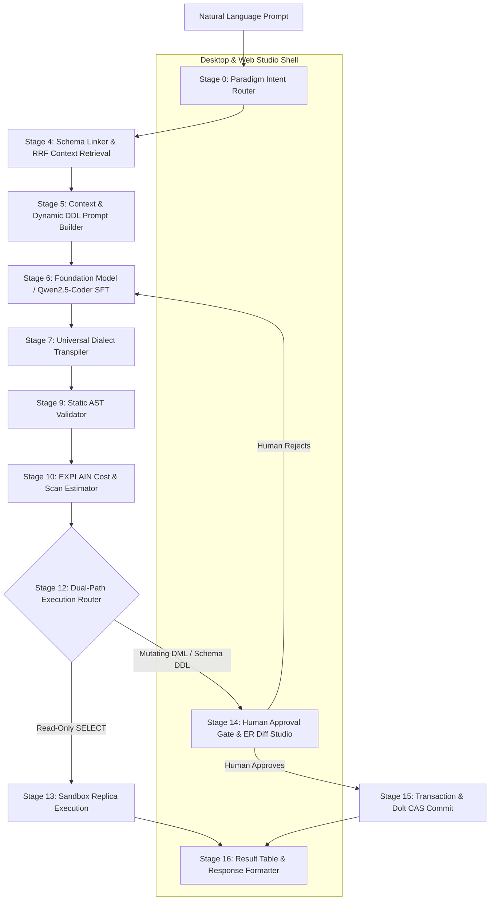

<div align="center">

# NL2SQL Production Pipeline

### Enterprise Natural Language to Multi-Paradigm Database Compiler

[](https://github.com/VanshikaKritiSingh/NL2SQL)
[](https://github.com/VanshikaKritiSingh/NL2SQL)
[](https://www.python.org/)
[](https://fastapi.tiangolo.com/)
[](https://react.dev/)
[](https://github.com/tobymao/sqlglot)
[](https://huggingface.co/Qwen/Qwen2.5-Coder-7B-Instruct)
[](LICENSE)

<br />

[Overview](#executive-summary) &bull; [Architecture](#system-architecture) &bull; [Paradigms & Dialects](#multi-paradigm--dialect-support) &bull; [Quick Start](#quick-start) &bull; [Directory Layout](#repository-structure) &bull; [Engineering Team](#engineering-team)

</div>

<br />

---

## Executive Summary

The **NL2SQL Production Pipeline** is an enterprise-grade compiler that transforms natural language questions into safe, deterministic, and optimized queries across relational, graph, document, and columnar storage engines.

Key capabilities:
- **Zero Unsupervised Production Writes:** Enforces a hard dual-path execution router where mutating (DML) and schema-altering (DDL) queries require human review in the Module 14 Approval Gate.
- **Multi-Paradigm AST Translation:** Compiles queries across 6 database paradigms (Relational SQL, Graph openCypher, Document MQL, Key-Value, OLAP, and Time-Series).
- **Sub-5ms Deterministic Transpilation:** Uses AST rewriting without LLM token cost to support 20+ SQL dialects.
- **Consumer Hardware Fine-Tuning:** 4-bit NF4 QLoRA pipeline optimized for local GPUs (< 7.5GB VRAM) and CPU GGUF quantization (~4.3GB RAM).

---

## System Architecture

The pipeline executes as a coordinated 16-stage pipeline with strict validation, cost estimation, and dual-path execution gating:



---

## Multi-Paradigm & Dialect Support

| Paradigm | Underlying Mechanism | Supported Dialects & Engines | Primary Use Case |
| :--- | :--- | :--- | :--- |
| **Relational (RDBMS)** | ANSI SQL & Relational Algebra | PostgreSQL, MySQL, SQLite, Oracle, T-SQL / SQL Server, MariaDB | Transactional records & business entities |
| **Column-Family / OLAP** | Vectorized Columnar Scanning | Snowflake, Google BigQuery, ClickHouse, DuckDB, Redshift, StarRocks, Trino, Presto, Spark SQL, Databricks | Analytical aggregations & data lakes |
| **Graph Database** | Declarative Graph Traversal | Neo4j, AWS Neptune (openCypher endpoint), Kuzu | Multi-hop relationships & shortest paths |
| **Document NoSQL** | Hierarchical MQL Aggregation | MongoDB, Amazon DocumentDB, CouchDB | Dynamic schemas & nested JSON documents |
| **Key-Value (KV)** | Hash Map Lookups & Mutations | Redis, Amazon DynamoDB (KV mode), Memcached | Point lookups & session token caches |
| **Time-Series** | Timestamp Bucket Aggregations | TimescaleDB, InfluxDB | Telemetry, metric streams & sliding windows |

---

## Repository Structure

```
NL2SQL/
|-- core/                            # Core Runtime Engine (AI/ML Backbone)
|   |-- paradigm_suggestor.py        # CLEF intent drafter & auto-mode speculative router
|   |-- schema_linker.py             # Hybrid BM25/Semantic RRF retrieval & Steiner join builder
|   |-- dialect_converter.py         # Deterministic AST transpiler (20+ SQL, Cypher, MQL)
|   |-- orchestrator.py              # Unified pipeline dispatcher & dual-path router
|   `-- README.md                    # Dedicated AI/ML handbook
|
|-- validator/                       # Static AST Validator & Policy Guardrails (Software & Security)
|   |-- contracts.py                 # Immutable validation issue models & status contracts
|   |-- engine.py                    # Multi-layer rule execution engine
|   `-- rules/                       # Parse, policy, schema, and semantic rule sets
|
|-- cost_estimator/                  # Query Cost & Blast-Radius Estimator (Software & Security)
|   |-- contracts.py                 # Cost report structures & threshold definitions
|   |-- thresholds.py                # Configurable row scan and execution limits
|   `-- adapters/postgres.py         # EXPLAIN plan parser & replica row estimator
|
|-- GUI/                             # Native Desktop & Web Interface Studio (Frontend & Systems)
|   |-- src/                         # React 18, TypeScript, Monaco Editor, React Flow ER Diagrams
|   |-- electron/                    # Electron container & native OS lifecycle bridge
|   |-- server/                      # FastAPI bridge stubs for pipeline integration
|   `-- README.md                    # Dedicated Desktop/Web Studio handbook
|
|-- offline/                         # AI/ML Offline Suite (Isolated from Git Volume)
|   |-- training/train_qlora.py      # 4-bit NF4 QLoRA fine-tuning script (< 7.5GB VRAM)
|   |-- training/export_gguf.py      # LoRA merge, GGUF quantizer & Ollama Modelfile exporter
|   |-- training/evaluate.py         # AST Exact Match & Execution Accuracy benchmark runner
|   |-- training/requirements-train.txt # Isolated ML dependencies (PyTorch, PEFT, TRL)
|   `-- datasets/prepare_dataset.py  # Multi-schema synthetic fine-tuning dataset generator
|
|-- scripts/                         # Cross-Platform Environment Setup & Automation
|   |-- setup_linux.sh               # Linux/macOS automated environment bootstrap
|   |-- setup_windows.ps1            # Windows PowerShell automated environment bootstrap
|   |-- setup_windows.bat            # Windows batch launcher
|   |-- generate_dataset.py          # CLI dataset generation tool
|   `-- README.md                    # Setup automation documentation
|
`-- tests/                           # Unit and integration test suite (13/13 passing)
```

---

## Subsystem Implementation Matrix

| Subsystem | Scope / Responsibility | Owner | Status |
| :--- | :--- | :--- | :--- |
| **Model Foundation & Training** | QLoRA fine-tuning & GGUF CPU export | Anunay Sharma | [](core/) |
| **Schema Linker** | Hybrid RRF retrieval & Steiner join injection | Anunay Sharma | [](core/) |
| **Dialect Transpiler** | SQL AST conversion (20+ dialects, Cypher, MQL) | Anunay Sharma | [](core/) |
| **Paradigm Router** | Intent classification & auto-routing | Anunay Sharma | [](core/) |
| **Pipeline Orchestrator** | End-to-end execution loop & dual-path router | Anunay Sharma | [](core/) |
| **Static Validator** | AST verification & anti-pattern detection | Sarthak Singh | [](validator/) |
| **Cost Estimator** | EXPLAIN plan cost & blast radius checks | Sarthak Singh | [](cost_estimator/) |
| **Approval Gate & Studio** | Desktop & Web Studio with ER diff visualization | Vanshika Kriti Singh | [](GUI/) |

---

## Quick Start

### 1. Automated Environment Bootstrap

#### Linux & macOS
```bash
# Clone the repository
git clone https://github.com/VanshikaKritiSingh/NL2SQL.git
cd NL2SQL

# Run automated setup (creates .venv, installs core packages, generates datasets)
chmod +x scripts/setup_linux.sh
./scripts/setup_linux.sh
```

#### Windows PowerShell
```powershell
# Clone the repository
git clone https://github.com/VanshikaKritiSingh/NL2SQL.git
cd NL2SQL

# Run PowerShell setup
.\scripts\setup_windows.ps1
```

---

### 2. Launch Desktop & Web Studio

```bash
# Navigate to GUI directory
cd GUI

# Option A: Launch Native Desktop Application (Live Dev)
npm run desktop:dev

# Option B: Launch Browser Web Client
npm run dev
```

---

### 3. Verification & Testing

```bash
# Run pytest verification suite (from repository root)
PYTHONPATH=. ./.venv/bin/pytest tests/ -v
```

```
============================== 17 passed in 0.16s ==============================
- CLEF Drafter Intent Routing (Graph, Document, KV, OLAP): PASSED
- Paradigm Suggestor Auto Mode & Manual Guardrails: PASSED
- Dialect Transpilation (PostgreSQL, MySQL, SQLite, Cypher, MQL): PASSED
- Categorical Value Trie Grounding: PASSED
- Steiner Tree FK Bridge Join Injection: PASSED
- Static AST Validator (Layers 1-5 & Anti-Patterns): PASSED
- Heuristic Cost & Execution Plan Estimator: PASSED
- End-to-End Orchestrator Dual-Path Routing: PASSED
```

---

## Engineering Team

| Member | Department / Role | Focus Area |
| :--- | :--- | :--- |
| **Anunay Sharma** | AI & Machine Learning | Schema Linker, Paradigm Router, Universal Transpiler, Offline QLoRA |
| **Sarthak Singh** | Software Dev & Security | Static AST Validator, Query Cost Estimator |
| **Vanshika Kriti Singh** | GUI & Systems Observability | Desktop & Web Studio Shell, Human Approval Gate |

---

<div align="center">

*NL2SQL Pipeline: Phase I & II Production Architecture Deliverable*

</div>
