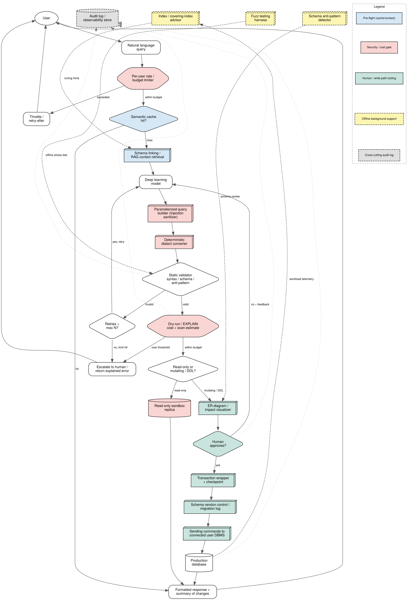
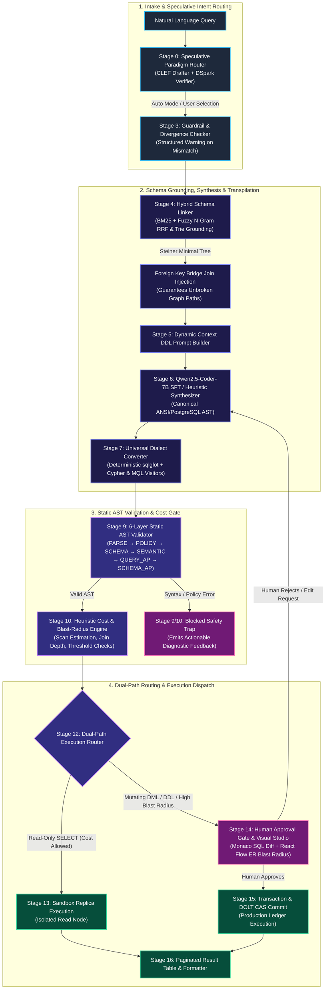
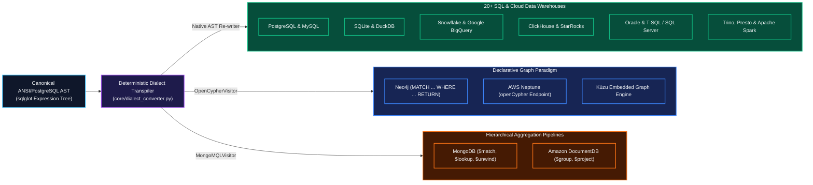
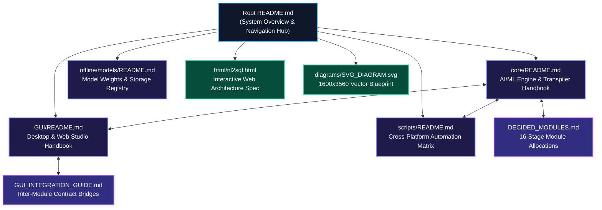

<div align="center">

# NL2SQL Production Pipeline

### Enterprise Natural Language to Multi-Paradigm Database Compiler

[](https://github.com/VanshikaKritiSingh/NL2SQL)
[](https://github.com/VanshikaKritiSingh/NL2SQL)
[](html/nl2sql.html)
[](diagrams/SVG_DIAGRAM.svg)
[](https://github.com/tobymao/sqlglot)
[](https://huggingface.co/Qwen/Qwen2.5-Coder-7B-Instruct)
[](LICENSE)

<br />

[Overview](#executive-summary) &bull; [Visual Blueprints](#interactive-specifications--visual-architecture-assets) &bull; [System Architecture](#system-architecture) &bull; [Universal Transpilation](#universal-ast-transpilation-engine) &bull; [Documentation Hub](#subsystem-documentation-hub) &bull; [Offline ML Suite](#offline-machine-learning--fine-tuning-suite) &bull; [Quick Start](#quick-start) &bull; [Team](#engineering-team)

</div>

<br />

---

## Executive Summary

The **NL2SQL Production Pipeline** is an enterprise-grade compilation framework that transforms natural language requests into deterministic, semantically validated, and cost-controlled queries across **6 database paradigms** and **20+ dialects**.

### Core Architecture Guarantees
1. **Zero Unsupervised Production Writes:** Mutating queries (`INSERT`, `UPDATE`, `DELETE`) and schema migrations (`ALTER`, `DROP`) are intercepted by a mandatory **Dual-Path Execution Router** and escalated to a visual human review gate.
2. **Deterministic Universal Transpilation:** Canonical ANSI/PostgreSQL AST is transpiled in `< 5ms` without runtime LLM token consumption into 20+ SQL dialects, openCypher (Neo4j / AWS Neptune), and MongoDB MQL.
3. **Speculative Intent Routing (DSpark Principles):** Fast CLEF-style discourse classifier (< 2ms) routes queries with speculative confidence scheduling and auto-mode divergence guardrails.
4. **Hybrid Schema Grounding:** Combines snake_case-aware BM25 and character N-gram fuzzy salience merged via **Reciprocal Rank Fusion (RRF)**, backed by Steiner Minimal Tree foreign-key bridge join injection and sub-millisecond Trie cell grounding.
5. **Consumer Hardware Feasibility:** 4-bit NF4 QLoRA fine-tuning fits consumer GPUs (< 7.5GB VRAM on RTX 4060 8GB / RTX 3060 12GB), quantizing to `Q4_K_M` GGUF for CPU inference (~4.3GB RAM).

---

## Interactive Specifications & Visual Architecture Assets

The NL2SQL architecture is specified across interactive web specifications, vector SVG blueprints, and high-definition raster renders:

<div align="center">

[](diagrams/SVG_DIAGRAM.svg)

<p><em>Click the diagram above to inspect the full 1600x3560 vector SVG master blueprint (<a href="diagrams/SVG_DIAGRAM.svg">diagrams/SVG_DIAGRAM.svg</a>)</em></p>

</div>

### Visual & Interactive Specification Catalog

| Asset | Format | Location | Primary Purpose | How to View |
| :--- | :--- | :--- | :--- | :--- |
| **Interactive Architecture Spec** | Standalone HTML / SVG | [`html/nl2sql.html`](html/nl2sql.html) | Interactive 16-stage pipeline guide with inlined vector SVG, stage reference table, and academic citations | Open in browser (`open html/nl2sql.html`) or serve via local HTTP server |
| **Master Architecture Blueprint** | Vector SVG (1600x3560) | [`diagrams/SVG_DIAGRAM.svg`](diagrams/SVG_DIAGRAM.svg) | High-precision vector architecture schematic with exact subsystem boundaries and stage markers | Open in browser, Figma, Miro, or Inkscape |
| **Pipeline High-Res Render** | 24-bit PNG | [`diagrams/pipeline_v2_check.png`](diagrams/pipeline_v2_check.png) | High-definition raster render for markdown renderers and presentation previews | Native image preview or GitHub file viewer |
| **Design Companion Template** | HTML / CSS | [`html/template.html`](html/template.html) | Design system typography, layout tokens, and interactive component prototypes | Open in browser (`open html/template.html`) |
| **Architecture Reference Document** | Markdown | [`NL2SQL-Pipeline-Architecture.md`](NL2SQL-Pipeline-Architecture.md) | Stage-by-stage text specification and companion document to `diagrams/SVG_DIAGRAM.svg` | Markdown viewer or GitHub |

#### Viewing the Interactive Web Specification Locally
```bash
# Option 1: Direct browser launch
# Linux
xdg-open html/nl2sql.html
# macOS
open html/nl2sql.html
# Windows
start html\nl2sql.html

# Option 2: Local HTTP server
python -m http.server 8080 --directory html/
# Then navigate to http://localhost:8080/nl2sql.html
```

---

## System Architecture

The pipeline executes through 16 human-supervised stages structured into four cohesive layers:



---

## Universal AST Transpilation Engine

A single canonical ANSI SQL AST is compiled deterministically into 20+ SQL, Graph, and Document targets in `< 5ms`:



---

## Multi-Paradigm & Dialect Support

| Paradigm | Underlying Mechanism | Supported Dialects & Engines | Primary Workload Focus |
| :--- | :--- | :--- | :--- |
| **Relational (RDBMS)** | ANSI SQL & Relational Algebra | PostgreSQL, MySQL, SQLite, Oracle, T-SQL / SQL Server, MariaDB | Transactional consistency, normalized tables |
| **Column-Family / OLAP** | Vectorized Columnar Scanning | Snowflake, Google BigQuery, ClickHouse, DuckDB, Redshift, StarRocks, Trino, Presto, Spark SQL, Databricks | Analytical aggregations, multi-billion row scans |
| **Graph Database** | Declarative Graph Traversal | Neo4j, AWS Neptune (openCypher endpoint), Kùzu | Multi-hop paths, shortest path, fraud rings |
| **Document NoSQL** | Hierarchical MQL Aggregation | MongoDB, Amazon DocumentDB, CouchDB | Dynamic schemas, polymorphic JSON sub-documents |
| **Key-Value (KV)** | Hash Map Lookups & Mutations | Redis, Amazon DynamoDB (KV mode), Memcached | Sub-millisecond point lookups, token store |
| **Time-Series** | Timestamp Bucket Aggregations | TimescaleDB, InfluxDB | Telemetry rollups, sliding sensor windows |

---

## 6-Layer Static AST Validation Architecture

Every generated query undergoes a 6-layer verification pipeline before cost estimation or execution:

```mermaid
flowchart TD
    classDef l1 fill:#0f172a,stroke:#38bdf8,stroke-width:2px,color:#f8fafc;
    classDef l2 fill:#1e1b4b,stroke:#818cf8,stroke-width:2px,color:#f8fafc;
    classDef l3 fill:#312e81,stroke:#a855f7,stroke-width:2px,color:#f8fafc;
    classDef l4 fill:#4c1d95,stroke:#c084fc,stroke-width:2px,color:#f8fafc;
    classDef l5 fill:#701a75,stroke:#f472b6,stroke-width:2px,color:#f8fafc;
    classDef l6 fill:#831843,stroke:#fb7185,stroke-width:2px,color:#f8fafc;

    Q[Canonical SQL Query] --> L1["Layer 1: PARSE<br/>• Single-statement enforcement (PARSE_01)<br/>• Syntax & AST grammar check (PARSE_02)"]:::l1
    L1 --> L2["Layer 2: POLICY<br/>• Statement allowlist (POLICY_01)<br/>• Block DROP DATABASE / TRUNCATE (POLICY_02)<br/>• Block GRANT / REVOKE & COPY PROGRAM (POLICY_03/04)<br/>• UPDATE/DELETE without WHERE guard (POLICY_05)"]:::l2
    L2 --> L3["Layer 3: SCHEMA<br/>• Table & column existence in catalog (SCHEMA_01/02)<br/>• Ambiguous join column detection (SCHEMA_03)<br/>• Alias reference resolution (SCHEMA_04)"]:::l3
    L3 --> L4["Layer 4: SEMANTIC<br/>• Non-aggregated column in GROUP BY check (SEM_01)<br/>• Aggregate in WHERE clause detection (SEM_02)<br/>• INSERT column/value parity (SEM_03)"]:::l4
    L4 --> L5["Layer 5: QUERY ANTI-PATTERNS<br/>• SELECT * production warning (QUERY_AP_01)<br/>• Cartesian product / CROSS JOIN check (QUERY_AP_02)<br/>• Leading-wildcard LIKE '%...' warning (QUERY_AP_03)<br/>• Unbounded ORDER BY without LIMIT (QUERY_AP_06)"]:::l5
    L5 --> L6["Layer 6: SCHEMA ANTI-PATTERNS (DDL)<br/>• CREATE TABLE without PRIMARY KEY (SCHEMA_AP_01)<br/>• Monetary FLOAT type warning (SCHEMA_AP_06)"]:::l6
    L6 --> PASS["Validation Passed (Status: VALID / VALID_WITH_WARNINGS)"]
```



---

## Offline Machine Learning & Fine-Tuning Suite

```mermaid
flowchart LR
    classDef stage fill:#1e1b4b,stroke:#818cf8,stroke-width:2px,color:#f8fafc;
    classDef artifact fill:#064e3b,stroke:#34d399,stroke-width:2px,color:#f8fafc;

    D_GEN["offline/datasets/prepare_dataset.py<br/>Multi-Schema Synthetic SFT Generator"]:::stage --> D_OUT["train.jsonl & eval.jsonl<br/>(ChatML Instruction Pairs)"]:::artifact
    
    D_OUT --> TRAIN["offline/training/train_qlora.py<br/>4-bit NF4 QLoRA SFT<br/>(Target All Linears, r=16, a=32)"]:::stage
    
    TRAIN --> ADAPTER["LoRA Checkpoints<br/>(< 7.5GB VRAM on RTX 4060)"]:::artifact
    
    ADAPTER --> EXPORT["offline/training/export_gguf.py<br/>16-bit Merge + GGUF Quantizer"]:::stage
    
    EXPORT --> GGUF["model-q4_k_m.gguf + Modelfile<br/>(~4.3GB RAM on CPU / Ollama)"]:::artifact
    
    GGUF --> EVAL["offline/training/evaluate.py<br/>AST Exact Match & SQLite EX Accuracy"]:::stage
```



---

## Repository Structure

```
NL2SQL/
|-- core/                            # Core Runtime Engine (AI/ML Backbone)
|   |-- paradigm_suggestor.py        # CLEF intent drafter & speculative router
|   |-- schema_linker.py             # Hybrid BM25/Fuzzy RRF retrieval & Steiner join builder
|   |-- dialect_converter.py         # Deterministic AST transpiler (20+ SQL, Cypher, MQL)
|   |-- orchestrator.py              # Unified pipeline dispatcher & dual-path router
|   `-- README.md                    # Dedicated AI/ML architectural handbook
|
|-- validator/                       # Static AST Validator & Policy Guardrails (Software & Security)
|   |-- contracts.py                 # Immutable validation issue models & contracts
|   |-- engine.py                    # 6-Layer static AST validation pipeline
|   |-- interfaces.py                # SchemaProvider & AuditLogger protocols
|   `-- rules/                       # Centralized RuleRegistry with dynamic toggles
|
|-- cost_estimator/                  # Query Cost & Blast-Radius Estimator (Software & Security)
|   |-- contracts.py                 # Cost report structures & threshold definitions
|   |-- thresholds.py                # Configurable row scan and execution limits
|   |-- engine.py                    # AST-driven heuristic cost & blast-radius engine
|   `-- adapters/postgres.py         # EXPLAIN plan parser & replica row estimator
|
|-- GUI/                             # Native Desktop & Web Interface Studio (Frontend & Systems)
|   |-- src/                         # React 18, TypeScript, Monaco Editor, React Flow ER Diagrams
|   |   |-- modules/
|   |   |   |-- query_intake/        # Query intake, Monaco editor, progress tracker
|   |   |   `-- approval_gate/       # React Flow ER graph_alter, Monaco diffs, telemetry
|   |-- electron/                    # Electron container & native OS lifecycle bridge
|   |-- server/                      # FastAPI bridge server for pipeline integration
|   `-- README.md                    # Dedicated Desktop/Web Studio handbook
|
|-- offline/                         # AI/ML Offline Suite (Isolated from Git Volume)
|   |-- training/train_qlora.py      # 4-bit NF4 QLoRA fine-tuning script (< 7.5GB VRAM)
|   |-- training/export_gguf.py      # LoRA merge, GGUF quantizer & Ollama Modelfile exporter
|   |-- training/evaluate.py         # AST Exact Match & Execution Accuracy benchmark runner
|   |-- training/requirements-train.txt # Isolated ML dependencies (PyTorch, PEFT, TRL)
|   `-- datasets/prepare_dataset.py  # Multi-schema synthetic fine-tuning dataset generator
|
|-- scripts/                         # Cross-Platform Environment Setup & Automation
|   |-- setup_linux.sh               # Linux/macOS automated environment bootstrap
|   |-- setup_windows.ps1            # Windows PowerShell automated environment bootstrap
|   |-- setup_windows.bat            # Windows batch launcher
|   |-- generate_dataset.py          # CLI dataset generation tool
|   `-- README.md                    # Setup automation documentation
|
`-- tests/                           # Comprehensive unit & integration test suite (17/17 passing)
    `-- test_core_modules.py         # End-to-end multi-paradigm and safety test suite
```

---

## Subsystem Documentation Hub

The NL2SQL repository follows a **Federated Documentation Architecture**. Rather than collapsing all module details into an unwieldy single file, each major engineering subsystem maintains its own dedicated, deep-dive handbook alongside its source code. All handbooks are unified via standardized navigation breadcrumbs and cross-subsystem links.



### Federated Handbook Matrix

| Handbook / Subsystem | Location | Lead Engineer | Scope & Core Responsibilities | Status |
| :--- | :--- | :--- | :--- | :--- |
| **Core AI/ML & Compiler** | [`core/README.md`](core/README.md) | Anunay Sharma | DSpark speculative routing, hybrid BM25/Fuzzy RRF schema linker, Steiner tree joins, 20+ SQL / Cypher / MQL transpiler | [](core/README.md) |
| **Desktop & Web Studio** | [`GUI/README.md`](GUI/README.md) | Vanshika Kriti Singh | Electron native lifecycle, React 18 / Vite hot reloading, Monaco SQL inspector, React Flow ER diff approval gate | [](GUI/README.md) |
| **Automation & Scripts** | [`scripts/README.md`](scripts/README.md) | Multi-Platform | POSIX Bash (`.sh`), PowerShell (`.ps1`), and CMD (`.bat`) launcher matrix, zero-GPU setup, and dataset synthesis | [](scripts/README.md) |
| **Offline Model Registry** | [`offline/models/README.md`](offline/models/README.md) | Anunay Sharma | Foundation model checkpoint storage (0.5B, 1.5B, 7B), GGUF quantizations, and download instructions | [](offline/models/README.md) |
| **GUI Integration Guide** | [`GUI_INTEGRATION_GUIDE.md`](GUI_INTEGRATION_GUIDE.md) | Vanshika Kriti Singh | Typed FastAPI contracts, WebSocket streaming specifications, and backend stub connection points | [](GUI_INTEGRATION_GUIDE.md) |
| **Decided Modules Spec** | [`DECIDED_MODULES.md`](DECIDED_MODULES.md) | All Leads | 16-stage pipeline functional definitions, role assignments, and phase progression | [](DECIDED_MODULES.md) |
| **Static AST Validator** | [`validator/`](validator/) | Sarthak Singh | 6-Layer verification pipeline (Parse, Policy, Schema, Semantic, Query Anti-Patterns, Schema Anti-Patterns) | [](validator/) |
| **Cost & Blast Radius Engine** | [`cost_estimator/`](cost_estimator/) | Sarthak Singh | Heuristic scan estimator, join depth evaluator, and PostgreSQL EXPLAIN plan adapter | [](cost_estimator/) |

---

## Quick Start

### 1. Automated Environment Bootstrap

#### Linux & macOS
```bash
git clone https://github.com/VanshikaKritiSingh/NL2SQL.git
cd NL2SQL

chmod +x scripts/setup_linux.sh
./scripts/setup_linux.sh
```

#### Windows PowerShell & CMD
```powershell
git clone https://github.com/VanshikaKritiSingh/NL2SQL.git
cd NL2SQL

# PowerShell
.\scripts\setup_windows.ps1

# Windows Command Prompt
scripts\setup_windows.bat
```

---

### 2. Launch Full-Stack Pipeline (FastAPI Backend + Web Studio)

```bash
# Linux / macOS
./scripts/start_all.sh

# Windows PowerShell
.\scripts\start_all.ps1

# Windows Command Prompt
scripts\start_all.bat
```

> **Individual Services:**
> - Backend API Server: `./scripts/start_backend.sh` (or `.\scripts\start_backend.ps1`)
> - Frontend Studio GUI: `./scripts/start_gui.sh` (or `.\scripts\start_gui.ps1`)
> - Desktop Electron App: `./scripts/start_gui.sh --desktop` (or `.\scripts\start_gui.ps1 -Desktop`)

---

### 3. Base Model Download & Offline Fine-Tuning

```bash
# Download foundation base model into offline/models/ (Presets: 0.5b, 1.5b, 7b, 7b-gguf)
./scripts/download_model.sh --preset 0.5b

# Start 4-bit NF4 QLoRA Fine-Tuning
./scripts/start_train.sh --epochs 3

# Run AST Exact Match & Execution Accuracy Evaluation
./scripts/start_eval.sh
```

---

### 4. Verification & Testing

```bash
# Run one-command test suite (Core pytest + FastAPI backend integration)
./scripts/run_tests.sh
```

```
============================== 17 passed in 0.16s ==============================
- CLEF Drafter Intent Routing (Graph, Document, KV, OLAP): PASSED
- Paradigm Suggestor Auto Mode & Manual Guardrails: PASSED
- Dialect Transpilation (PostgreSQL, MySQL, SQLite, Cypher, MQL): PASSED
- Categorical Value Trie Grounding: PASSED
- Steiner Tree FK Bridge Join Injection: PASSED
- 6-Layer Static AST Validator (Layers 1-6 & Anti-Patterns): PASSED
- Heuristic Cost & Execution Plan Estimator: PASSED
- End-to-End Orchestrator Dual-Path Routing: PASSED
[OK] Root health check passed: NL2SQL Pipeline API
[OK] Schema endpoint passed (4 tables, 3 FKs)
[OK] SELECT Query intake passed (status=completed, rows=5)
[OK] UPDATE Query approval gate triggered (status=approval_required, risk=high)
[OK] DDL Query approval gate triggered (status=approval_required, diff=ddl)
[OK] Approval decision passed (status=approved_executing)
[OK] Query history passed (3 items logged)
ALL INTEGRATION & VERIFICATION TESTS PASSED 100%!
```

---

## Engineering Team

| Member | Department / Role | Focus Area |
| :--- | :--- | :--- |
| **Anunay Sharma** | AI & Machine Learning | Schema Linker, Paradigm Router, Universal Transpiler, Offline QLoRA |
| **Sarthak Singh** | Software Dev & Security | 6-Layer Static AST Validator, Query Cost Estimator |
| **Vanshika Kriti Singh** | GUI & Systems Observability | Desktop & Web Studio Shell, Human Approval Gate |

---

<div align="center">

*NL2SQL Pipeline: Phase I & II Production Architecture Deliverable*

</div>
