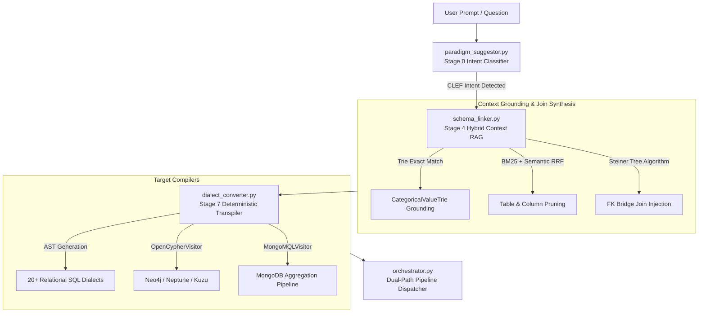
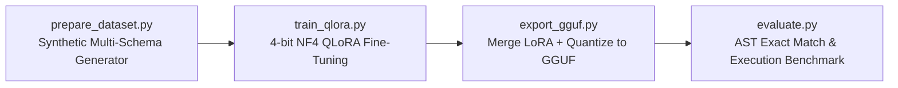

<div align="center">

# NL2SQL Core Engine & AI/ML Architecture

### Multi-Paradigm Intent Routing, Semantic Schema Context Pruning, and Deterministic Transpilation

[](https://github.com/VanshikaKritiSingh/NL2SQL)
[](https://github.com/VanshikaKritiSingh/NL2SQL)
[](https://github.com/VanshikaKritiSingh/NL2SQL)
[](https://github.com/tobymao/sqlglot)
[](https://huggingface.co/)

<br />

**Lead AI/ML Engineer:** Anunay Sharma &nbsp;|&nbsp; **Package:** `core/` & `offline/`

</div>

<br />

---

## Architecture & Execution Flow

The `core/` package provides the deterministic compilation engine, semantic context retrieval, and multi-paradigm intent routing for the pipeline:



---

## Core Components Catalog

### 1. `core/paradigm_suggestor.py`
- **CLEF Discourse & Structural Drafter:** CPU-efficient regex pattern mining running in under 2ms to detect graph traversal paths, time-series windows, nested JSON structures, or point lookups.
- **Speculative Confidence Scheduler:** Drafts with confidence > 0.85 route immediately; ambiguous queries trigger lightweight model verification.
- **Auto Mode Routing:** Recommends optimal storage engines with educational trade-off explanations.
- **Manual Divergence Guardrail:** When a user selects a sub-optimal engine (e.g., executing multi-hop recursive queries on standard MySQL), generates a structured `Paradigm Divergence Warning` while strictly honoring user intent.

### 2. `core/schema_linker.py`
- **Categorical Cell Grounding:** Offline `CategoricalValueTrie` maps entities and categorical values (e.g. `'shipped'`, `'Germany'`) to specific database columns without live DB querying.
- **Hybrid Retrieval:** Blends snake_case-aware BM25 and dense embeddings using Reciprocal Rank Fusion (RRF).
- **Steiner Tree / Graph Shortest Path:** Models schema as an undirected graph (V=tables, E=FK constraints) and auto-injects intermediate bridge tables to prevent broken joins.
- **Token Pruning:** Prioritizes PKs, FKs, and grounded filter columns to fit constrained LLM context windows.

### 3. `core/dialect_converter.py`
- **Zero-Token Transpilation:** Transforms canonical ANSI AST into target engine syntax deterministically in under 5ms.
- **`OpenCypherVisitor`:** Maps table joins to declarative graph edge patterns (e.g. `(u:Users)-[:PLACED]->(o:Orders)`).
- **`MongoMQLVisitor`:** Maps relational `SELECT / WHERE / GROUP BY` into native `$match`, `$group`, `$sort`, and `$limit` pipelines.
- **Typed Error Envelopes:** Emits `DialectFeatureUnsupportedError` when target engines lack specific AST capabilities.

### 4. `core/orchestrator.py`
- **Unified Pipeline Execution:** Connects AI/ML parsing, static validation (`validator`), cost estimation (`cost_estimator`), and GUI dispatch.
- **Dual-Path Routing:** Automatically routes safe read queries to `SANDBOX_REPLICA` and flags mutating / DDL queries for human review in `APPROVAL_GATE`.

---

## Supported Paradigms & 20+ Dialects Matrix

| Paradigm | Underlying Mechanism | Supported Dialects & Engines | Workload Focus |
| :--- | :--- | :--- | :--- |
| **1. Relational (RDBMS)** | ANSI SQL & Relational Algebra | PostgreSQL, MySQL, SQLite, Oracle, T-SQL / SQL Server, MariaDB | Normalized transactional records |
| **2. Column-Family / OLAP** | Vectorized Columnar Scanning | Snowflake, Google BigQuery, ClickHouse, DuckDB, Redshift, StarRocks, Trino, Presto, Spark SQL, Databricks | Analytical aggregations, time-series cubes |
| **3. Graph Database** | Declarative Graph Traversal | Neo4j, AWS Neptune (openCypher endpoint), Kuzu | Multi-hop paths, shortest path, fraud rings |
| **4. Document NoSQL** | JSON MQL Aggregation Pipelines | MongoDB, Amazon DocumentDB, CouchDB | Dynamic schemas, nested JSON sub-documents |
| **5. Key-Value (KV)** | Hash Map Lookups & Mutations | Redis, Amazon DynamoDB (KV mode), Memcached | Sub-millisecond point lookups, token store |
| **6. Time-Series** | Timestamp Bucket Aggregations | TimescaleDB, InfluxDB | Telemetry rollups, sensor streaming |

---

## Offline Machine Learning & Fine-Tuning Suite (`offline/`)



- **Base Foundation:** `Qwen/Qwen2.5-Coder-7B-Instruct` or `DeepSeek-Coder-V2-Lite`.
- **Target Hardware:** Consumer GPUs (RTX 4060 8GB / RTX 3060 12GB) for training; standard CPU (4.3GB RAM at Q4_K_M) for production inference.
- **Evaluation Metrics:** AST Exact Match (EM) via `sqlglot` AST equality and Live Execution Accuracy (EX) on sandboxed databases.
- **Git Cleanliness:** Checkpoint files (`*.safetensors`, `*.gguf`) and datasets are strictly excluded from git tracking.

---

## Verification & Testing

```bash
PYTHONPATH=. ./.venv/bin/pytest tests/ -v
```

```
============================== 17 passed in 0.16s ==============================
- CLEF Drafter Intent Routing (Graph, Document, KV, OLAP): PASSED
- Paradigm Suggestor Auto Mode & Manual Guardrails: PASSED
- Dialect Transpilation (PostgreSQL, MySQL, SQLite, Cypher, MQL): PASSED
- Categorical Value Trie Grounding: PASSED
- Steiner Tree FK Bridge Join Injection: PASSED
- Static AST Validator (Layers 1-5 & Anti-Patterns): PASSED
- Heuristic Cost & Execution Plan Estimator: PASSED
- End-to-End Pipeline Orchestration & Dual-Path Routing: PASSED
```

---

<div align="center">

*NL2SQL Core Package: Technical Documentation & Implementation Reference*

</div>
