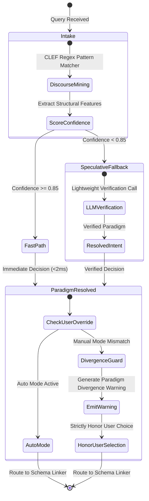
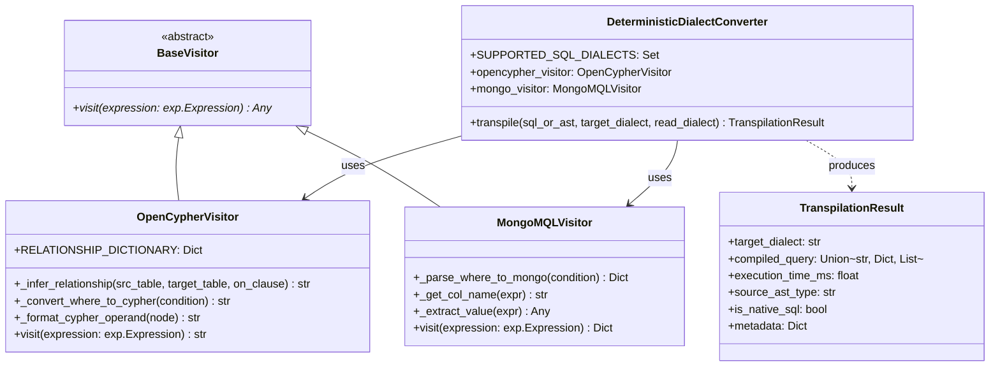

<div align="center">

# NL2SQL Core Engine & AI/ML Architecture

### Multi-Paradigm Intent Routing, Semantic Schema Context Pruning, and Deterministic Transpilation

[](https://github.com/VanshikaKritiSingh/NL2SQL)
[](https://github.com/VanshikaKritiSingh/NL2SQL)
[](../html/nl2sql.html)
[](../diagrams/SVG_DIAGRAM.svg)
[](https://github.com/VanshikaKritiSingh/NL2SQL)
[](https://github.com/tobymao/sqlglot)
[](https://huggingface.co/)

<br />

**Lead AI/ML Engineer:** Anunay Sharma &nbsp;|&nbsp; **Package:** `core/` & `offline/`

<br />

[Root Overview](../README.md) &bull; [Visual Blueprint](../diagrams/SVG_DIAGRAM.svg) &bull; [Interactive Spec](../html/nl2sql.html) &bull; [Studio GUI](../GUI/README.md) &bull; [Scripts & Automation](../scripts/README.md) &bull; [Offline Models](../offline/models/README.md)

</div>

<br />

---

## Architecture & Subsystem Execution Flow

The `core/` package provides the deterministic compilation engine, semantic context retrieval, and multi-paradigm intent routing for the pipeline:

```mermaid
flowchart TD
    classDef intake fill:#1e293b,stroke:#38bdf8,stroke-width:2px,color:#f8fafc;
    classDef rag fill:#1e1b4b,stroke:#818cf8,stroke-width:2px,color:#f8fafc;
    classDef graph fill:#312e81,stroke:#a855f7,stroke-width:2px,color:#f8fafc;
    classDef target fill:#064e3b,stroke:#34d399,stroke-width:2px,color:#f8fafc;
    classDef dispatch fill:#831843,stroke:#fb7185,stroke-width:2px,color:#f8fafc;

    NL["User Natural Language Query"]:::intake --> PS["paradigm_suggestor.py<br/>Stage 0: CLEF Intent Drafter"]:::intake
    
    subgraph Speculative_Routing ["Speculative Intent Routing (DSpark Principles)"]
        PS --> CONF{"Confidence Check<br/>(threshold = 0.85)"}:::intake
        CONF -->|"Confidence ≥ 0.85"| FAST["Fast-Path Execution Route"]:::intake
        CONF -->|"Confidence < 0.85"| VERIFY["Base Model Verification Gate"]:::intake
        FAST --> PARADIGM["Selected Paradigm & Recommended Engines"]:::intake
        VERIFY --> PARADIGM
    end

    PARADIGM --> SL["schema_linker.py<br/>Stage 4: Hybrid Schema Context Retrieval"]:::rag

    subgraph Context_Grounding ["Context Grounding & Relational Synthesis"]
        SL --> TRIE["CategoricalValueTrie<br/>(Sub-ms Punctuation-Safe Cell Grounding)"]:::rag
        SL --> RRF["Hybrid BM25 + Character 3-Gram Fuzzy Retrieval<br/>(Reciprocal Rank Fusion with rrf_k=60)"]:::rag
        TRIE --> SEEDS["Ranked Candidate Tables & Columns"]:::rag
        RRF --> SEEDS
        SEEDS --> STEINER["Steiner Minimal Tree / Graph Closure<br/>(Auto-Injects Foreign Key Bridge Tables)"]:::graph
        STEINER --> PROMPT_DDL["LinkedSchemaContext (Table-Qualified DDL Fragment)"]:::rag
    end

    PROMPT_DDL --> SYNTH["orchestrator.py / Qwen2.5-Coder-7B SFT<br/>(Canonical ANSI/PostgreSQL AST)"]:::rag

    SYNTH --> DC["dialect_converter.py<br/>Stage 7: Deterministic Dialect Transpiler"]:::target

    subgraph Target_Transpilation ["Multi-Paradigm AST Visitors"]
        DC -->|"sqlglot AST Rewriter"| SQL_TARGETS["20+ Relational SQL Dialects<br/>(Postgres, MySQL, DuckDB, Snowflake, etc.)"]:::target
        DC -->|"OpenCypherVisitor"| CYPHER_TARGETS["Declarative Graph Queries<br/>(Neo4j, AWS Neptune, Kùzu)"]:::target
        DC -->|"MongoMQLVisitor"| MONGO_TARGETS["Aggregation Pipelines ($match, $lookup, $group)<br/>(MongoDB, DocumentDB)"]:::target
    end

    SQL_TARGETS --> DISPATCH["orchestrator.py<br/>(Stage 12: Dual-Path Safety Dispatcher)"]:::dispatch
    CYPHER_TARGETS --> DISPATCH
    MONGO_TARGETS --> DISPATCH
```

---

## Speculative Intent Routing State Machine

Inspired by **DSpark** (Cheng et al., 2026), intent classification uses confidence-scheduled speculative drafting to maintain low inference latencies:



---

## Core Components Catalog

### 1. `core/paradigm_suggestor.py`
- **CLEF Discourse & Structural Drafter:** CPU-efficient regex pattern mining running in under 2ms to detect graph traversal paths, time-series windows, nested JSON structures, or point lookups.
- **Speculative Confidence Scheduler:** Drafts with confidence $\ge 0.85$ route immediately; ambiguous queries trigger lightweight model verification.
- **Auto Mode Routing:** Recommends optimal storage engines with educational trade-off explanations.
- **Manual Divergence Guardrail:** When a user selects a sub-optimal engine (e.g., executing multi-hop recursive queries on standard MySQL), generates a structured `Paradigm Divergence Warning` while strictly honoring user intent.

### 2. `core/schema_linker.py`
- **Categorical Cell Grounding:** Offline `CategoricalValueTrie` maps entities and categorical values (e.g. `'shipped'`, `'Germany'`) to specific database columns without live DB querying.
- **True Hybrid Retrieval:** Blends snake_case-aware BM25 and character 3-gram fuzzy salience using **Reciprocal Rank Fusion (RRF)** parameterized by `rrf_k=60`.
- **Steiner Tree / Graph Shortest Path:** Models schema as an undirected graph ($V=\text{tables}$, $E=\text{FK constraints}$) and auto-injects intermediate bridge tables to prevent broken joins.
- **Token Pruning:** Prioritizes PKs, FKs, and grounded filter columns to fit constrained LLM context windows.

### 3. `core/dialect_converter.py`
- **Zero-Token Transpilation:** Transforms canonical ANSI AST into target engine syntax deterministically in under 5ms.
- **`OpenCypherVisitor`:** Maps relational joins to declarative graph edge patterns (e.g. `(u:Users)-[:PLACED]->(o:Orders)`), handles aggregations, aliasing, and WHERE predicates.
- **`MongoMQLVisitor`:** Maps relational `SELECT / JOIN / WHERE / GROUP BY` into native `$match`, `$lookup`, `$unwind`, `$group`, `$project`, `$sort`, and `$limit` pipelines.
- **Typed Error Envelopes:** Emits `DialectFeatureUnsupportedError` when target engines lack specific AST capabilities.

### 4. `core/orchestrator.py`
- **Unified Pipeline Execution:** Connects AI/ML parsing, semantic query synthesis, 6-layer static validation (`validator`), cost estimation (`cost_estimator`), and GUI dispatch.
- **`SemanticSQLSynthesizer`:** Offline heuristic query synthesizer that constructs valid SQL AST queries from natural language intent when running offline or without an active LLM daemon.
- **Dual-Path Routing:** Automatically routes safe read queries to `SANDBOX_REPLICA` and flags mutating / DDL queries for human review in `APPROVAL_GATE`.

---

## AST Visitor & Transpiler Class Hierarchy



---

## Supported Paradigms & 20+ Dialects Matrix

| Paradigm | Underlying Mechanism | Supported Dialects & Engines | Workload Focus |
| :--- | :--- | :--- | :--- |
| **1. Relational (RDBMS)** | ANSI SQL & Relational Algebra | PostgreSQL, MySQL, SQLite, Oracle, T-SQL / SQL Server, MariaDB | Normalized transactional records |
| **2. Column-Family / OLAP** | Vectorized Columnar Scanning | Snowflake, Google BigQuery, ClickHouse, DuckDB, Redshift, StarRocks, Trino, Presto, Spark SQL, Databricks | Analytical aggregations, time-series cubes |
| **3. Graph Database** | Declarative Graph Traversal | Neo4j, AWS Neptune (openCypher endpoint), Kùzu | Multi-hop paths, shortest path, fraud rings |
| **4. Document NoSQL** | JSON MQL Aggregation Pipelines | MongoDB, Amazon DocumentDB, CouchDB | Dynamic schemas, nested JSON sub-documents |
| **5. Key-Value (KV)** | Hash Map Lookups & Mutations | Redis, Amazon DynamoDB (KV mode), Memcached | Sub-millisecond point lookups, token store |
| **6. Time-Series** | Timestamp Bucket Aggregations | TimescaleDB, InfluxDB | Telemetry rollups, sensor streaming |

---

## Offline Machine Learning & Fine-Tuning Suite (`offline/`)

```mermaid
flowchart LR
    classDef stage fill:#1e1b4b,stroke:#818cf8,stroke-width:2px,color:#f8fafc;
    classDef artifact fill:#064e3b,stroke:#34d399,stroke-width:2px,color:#f8fafc;

    DS["prepare_dataset.py<br/>Synthetic Multi-Schema Generator"]:::stage --> DATA["train.jsonl & eval.jsonl<br/>(ChatML SFT Formatted)"]:::artifact
    
    DATA --> SFT["train_qlora.py<br/>4-bit NF4 QLoRA Fine-Tuning"]:::stage
    
    SFT --> LORA["LoRA Checkpoints<br/>(Fits < 7.5GB VRAM on RTX 4060)"]:::artifact
    
    LORA --> EXP["export_gguf.py<br/>Merge LoRA + Quantize to GGUF"]:::stage
    
    EXP --> GGUF["model-q4_k_m.gguf + Modelfile<br/>(~4.3GB RAM on CPU / Ollama)"]:::artifact
    
    GGUF --> EVAL["evaluate.py<br/>AST Exact Match & Execution Benchmark"]:::stage
```



- **Base Foundation:** `Qwen/Qwen2.5-Coder-7B-Instruct` or `DeepSeek-Coder-V2-Lite`.
- **Target Hardware:** Consumer GPUs (RTX 4060 8GB / RTX 3060 12GB) for training; standard CPU (4.3GB RAM at Q4_K_M) for production inference.
- **Evaluation Metrics:** AST Exact Match (EM) via `sqlglot` AST equality and Live Execution Accuracy (EX) on sandboxed databases.
- **Git Cleanliness:** Checkpoint files (`*.safetensors`, `*.gguf`) and datasets are strictly excluded from git tracking.

---

## Verification & Testing

```bash
PYTHONPATH=. ./.venv/bin/pytest tests/ -v
```

```
============================== 17 passed in 0.17s ==============================
- CLEF Drafter Intent Routing (Graph, Document, KV, OLAP): PASSED
- Paradigm Suggestor Auto Mode & Manual Guardrails: PASSED
- Dialect Transpilation (PostgreSQL, MySQL, SQLite, Cypher, MQL): PASSED
- Categorical Value Trie Grounding: PASSED
- Steiner Tree FK Bridge Join Injection: PASSED
- 6-Layer Static AST Validator (Layers 1-6 & Anti-Patterns): PASSED
- Heuristic Cost & Execution Plan Estimator: PASSED
- End-to-End Pipeline Orchestration & Dual-Path Routing: PASSED
```

---

## Related Subsystem Documentation & Specifications

- **Root Pipeline Overview:** [`../README.md`](../README.md)
- **Interactive Architecture Specification:** [`../html/nl2sql.html`](../html/nl2sql.html)
- **High-Resolution Master Blueprint:** [`../diagrams/SVG_DIAGRAM.svg`](../diagrams/SVG_DIAGRAM.svg)
- **Desktop & Web Studio Handbook:** [`../GUI/README.md`](../GUI/README.md)
- **Cross-Platform Script Automation:** [`../scripts/README.md`](../scripts/README.md)
- **Offline Model Checkpoint Registry:** [`../offline/models/README.md`](../offline/models/README.md)
- **Static AST Validator Package:** [`../validator/`](../validator/)
- **Query Cost & Blast Radius Estimator:** [`../cost_estimator/`](../cost_estimator/)

---

<div align="center">

*NL2SQL Core Package: Technical Documentation & Implementation Reference*

</div>
