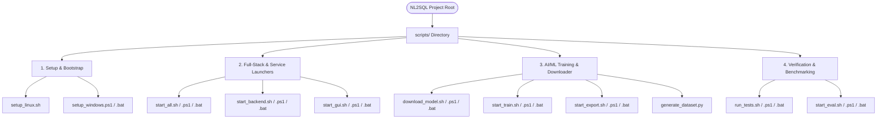

<div align="center">

# Cross-Platform Automation & Execution Scripts

### Complete CLI & GUI Orchestration Suite for Windows, Linux, & macOS

[](https://github.com/VanshikaKritiSingh/NL2SQL)
[](https://github.com/VanshikaKritiSingh/NL2SQL)
[](../html/nl2sql.html)
[](../diagrams/SVG_DIAGRAM.svg)
[](https://github.com/VanshikaKritiSingh/NL2SQL)
[](https://github.com/VanshikaKritiSingh/NL2SQL)

<br />

[Root Overview](../README.md) &bull; [Visual Blueprint](../diagrams/SVG_DIAGRAM.svg) &bull; [Interactive Spec](../html/nl2sql.html) &bull; [Core AI/ML Engine](../core/README.md) &bull; [Studio GUI](../GUI/README.md) &bull; [Offline Models](../offline/models/README.md)

</div>

<br />

---

## Architecture & Script Matrix

Every workflow in the NL2SQL repository provides native executable scripts across three shell environments:
1. **Linux / macOS (`.sh`)**: POSIX-compliant bash scripts with ANSI color formatting and auto-venv resolution.
2. **Windows PowerShell (`.ps1`)**: Native PowerShell scripts with typed CLI switches and process management.
3. **Windows Command Prompt (`.bat`)**: Double-clickable batch wrappers that automatically bypass execution policies.



---

## Complete Script Catalog

| Task / Purpose | Linux & macOS (Bash) | Windows PowerShell | Windows CMD / Double-Click | Description |
| :--- | :--- | :--- | :--- | :--- |
| **Full Environment Setup** | `./scripts/setup_linux.sh` | `.\scripts\setup_windows.ps1` | `scripts\setup_windows.bat` | Installs `.venv`, core pip packages, GUI npm packages, and creates local dataset |
| **Start Full Stack** | `./scripts/start_all.sh` | `.\scripts\start_all.ps1` | `scripts\start_all.bat` | Launches FastAPI backend (8000) and Web Studio UI (5173) concurrently |
| **Start Backend Server** | `./scripts/start_backend.sh` | `.\scripts\start_backend.ps1` | `scripts\start_backend.bat` | Launches FastAPI backend server on `127.0.0.1:8000` with hot-reload |
| **Start Frontend UI** | `./scripts/start_gui.sh` | `.\scripts\start_gui.ps1` | `scripts\start_gui.bat` | Launches Vite Web Studio UI or Electron desktop app (`--desktop`) |
| **Download Base Model** | `./scripts/download_model.sh` | `.\scripts\download_model.ps1` | `scripts\download_model.bat` | Downloads Qwen2.5-Coder model presets from Hugging Face into `offline/models/` |
| **Run All Tests** | `./scripts/run_tests.sh` | `.\scripts\run_tests.ps1` | `scripts\run_tests.bat` | Runs 17/17 pytest suite + FastAPI backend integration test suite |
| **Fine-Tune Model (QLoRA)** | `./scripts/start_train.sh` | `.\scripts\start_train.ps1` | `scripts\start_train.bat` | Initiates 4-bit NF4 QLoRA fine-tuning on consumer GPU / CPU |
| **Benchmark Evaluation** | `./scripts/start_eval.sh` | `.\scripts\start_eval.ps1` | `scripts\start_eval.bat` | Benchmarks AST Exact Match (EM) and SQLite Execution Accuracy (EX) |
| **LoRA Merge & GGUF Export** | `./scripts/start_export.sh` | `.\scripts\start_export.ps1` | `scripts\start_export.bat` | Merges LoRA adapters and prepares GGUF / Ollama Modelfile |
| **Generate Synthetic Dataset**| `python scripts/generate_dataset.py` | `python scripts\generate_dataset.py` | — | Synthesizes multi-domain instruction dataset locally in `offline/datasets/` |

---

## Detailed Usage Guides

### 1. Unified Full-Stack Launcher (`start_all`)
Launches the full pipeline (FastAPI backend + Vite Web Studio) in a single terminal. On Linux/macOS, handles `SIGINT`/`SIGTERM` to gracefully kill background processes:

```bash
# Linux / macOS
./scripts/start_all.sh

# Launch with Electron Desktop GUI
./scripts/start_all.sh --desktop

# Windows PowerShell
.\scripts\start_all.ps1
.\scripts\start_all.ps1 -Desktop

# Windows Command Prompt
scripts\start_all.bat
```

### 2. Base Model Downloader (`download_model`)
Downloads foundation models directly from Hugging Face into `offline/models/` without exceeding git volume restrictions:

```bash
# Linux / macOS
./scripts/download_model.sh --preset 0.5b      # Rapid download (0.93GB, edge & CPU testing)
./scripts/download_model.sh --preset 1.5b      # Balanced model (3.1GB)
./scripts/download_model.sh --preset 7b        # SOTA Flagship (14.2GB, target for QLoRA)
./scripts/download_model.sh --preset 7b-gguf   # Quantized Q4_K_M (~4.3GB, zero-GPU CPU inference)
./scripts/download_model.sh --list             # List available presets

# Windows PowerShell
.\scripts\download_model.ps1 -Preset 0.5b
.\scripts\download_model.ps1 -Preset 7b
.\scripts\download_model.ps1 -ListPresets

# Windows Command Prompt
scripts\download_model.bat --preset 0.5b
```

### 3. Verification & Integration Test Suite (`run_tests`)
Executes the full test suite across the repository:
1. `tests/test_core_modules.py` (17 unit and integration tests)
2. `GUI/server/test_backend.py` (FastAPI router endpoints & orchestrator verification)

```bash
# Linux / macOS
./scripts/run_tests.sh

# Windows PowerShell
.\scripts\run_tests.ps1

# Windows Command Prompt
scripts\run_tests.bat
```

### 4. Offline Fine-Tuning Launcher (`start_train`)
Launches 4-bit NF4 QLoRA instruction tuning on the local dataset:

```bash
# Linux / macOS
./scripts/start_train.sh                                     # Uses local offline/models/ base model
./scripts/start_train.sh --model Qwen/Qwen2.5-Coder-7B-Instruct --epochs 3

# Windows PowerShell
.\scripts\start_train.ps1
.\scripts\start_train.ps1 -Model "Qwen/Qwen2.5-Coder-7B-Instruct" -Epochs 3

# Windows Command Prompt
scripts\start_train.bat
```

### 5. Benchmark Evaluator (`start_eval`)
Measures SQL structural accuracy and real-world execution correctness:

```bash
# Linux / macOS
./scripts/start_eval.sh

# Windows PowerShell
.\scripts\start_eval.ps1

# Windows Command Prompt
scripts\start_eval.bat
```

---

## Volume Protection & `.gitignore` Compliance

All scripts adhere strictly to the repository volume protection policy:
- **`offline/models/*`**: Large model weights (`.safetensors`, `.bin`, `.gguf`) stay locally in `offline/models/` and are never committed to git.
- **`offline/checkpoints/*`**: Training checkpoint weights are excluded from version control.
- **`offline/datasets/*.json` & `*.jsonl`**: Synthetic datasets are generated on demand via `scripts/generate_dataset.py` (0 bytes committed to git).
- **Repository Size**: Maintained strictly under 15 MB for instant cloning on student and researcher machines.

---

## Related Subsystem Documentation & Specifications

- **Root Pipeline Overview:** [`../README.md`](../README.md)
- **Interactive Architecture Specification:** [`../html/nl2sql.html`](../html/nl2sql.html)
- **High-Resolution Master Blueprint:** [`../diagrams/SVG_DIAGRAM.svg`](../diagrams/SVG_DIAGRAM.svg)
- **Core AI/ML Engine & Transpiler Handbook:** [`../core/README.md`](../core/README.md)
- **Desktop & Web Studio Handbook:** [`../GUI/README.md`](../GUI/README.md)
- **Offline Model Checkpoint Registry:** [`../offline/models/README.md`](../offline/models/README.md)

---

<div align="center">

*NL2SQL Environment Scripts: Complete Cross-Platform Specification*

</div>
