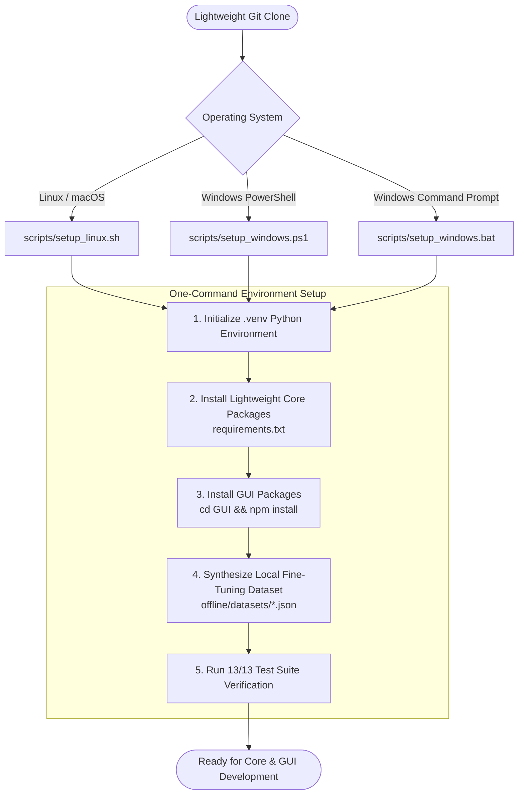

<div align="center">

# Environment Bootstrap & Setup Scripts

### Cross-Platform Environment Setup & Volume Protection Automation

[](https://github.com/VanshikaKritiSingh/NL2SQL)
[](https://github.com/VanshikaKritiSingh/NL2SQL)
[](https://github.com/VanshikaKritiSingh/NL2SQL)
[](https://github.com/VanshikaKritiSingh/NL2SQL)

</div>

<br />

---

## Setup Workflow & Volume Protection

The setup automation is structured to keep the Git repository lightweight (< 15MB) by dynamically creating virtual environments, generating fine-tuning data on demand, and cleanly ignoring heavy artifacts via `.gitignore`:



---

## Script Options & Commands

### 1. Linux & macOS (`scripts/setup_linux.sh`)

```bash
# Make script executable
chmod +x scripts/setup_linux.sh

# Standard Setup: Core Python runtime + GUI npm packages + Local fine-tuning dataset
./scripts/setup_linux.sh

# Full AI/ML Setup: Installs heavy PyTorch, Transformers, PEFT, and TRL
./scripts/setup_linux.sh --ml

# Headless Setup: Skip Node/NPM GUI setup (CI/CD or backend development)
./scripts/setup_linux.sh --skip-gui

# Skip Dataset Generation: Use existing dataset
./scripts/setup_linux.sh --no-data
```

### 2. Windows PowerShell (`scripts/setup_windows.ps1`)

```powershell
# Standard Setup: Core Python runtime + GUI npm packages + Local fine-tuning dataset
.\scripts\setup_windows.ps1

# Full AI/ML Setup: Installs heavy PyTorch, Transformers, PEFT, and TRL
.\scripts\setup_windows.ps1 -InstallML

# Headless Setup: Skip GUI npm install
.\scripts\setup_windows.ps1 -SkipGUI

# Skip Dataset Generation
.\scripts\setup_windows.ps1 -SkipData
```

### 3. Windows Batch Launcher (`scripts/setup_windows.bat`)
Double-click `scripts\setup_windows.bat` in Windows Explorer or run from CMD:
```cmd
scripts\setup_windows.bat
```

---

## Dataset Generation Utility (`scripts/generate_dataset.py`)

Synthesize multi-schema fine-tuning data on demand without storing bulky JSON files in git:

```bash
# Run CLI generator (outputs to offline/datasets/)
python scripts/generate_dataset.py --sample-count 250 --output-dir offline/datasets

# Output files generated (Strictly git-ignored):
# - offline/datasets/train.json   (Raw pair format)
# - offline/datasets/eval.json    (Evaluation split)
# - offline/datasets/train.jsonl  (ChatML SFT format for Qwen2.5-Coder)
# - offline/datasets/eval.jsonl   (ChatML evaluation format)
```

---

<div align="center">

*NL2SQL Environment Scripts: Technical Specification & Usage*

</div>
